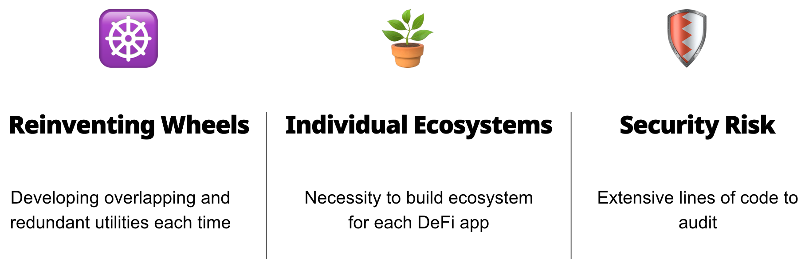
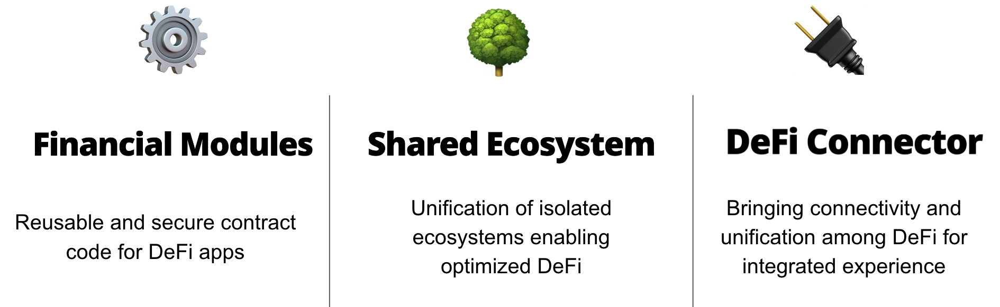
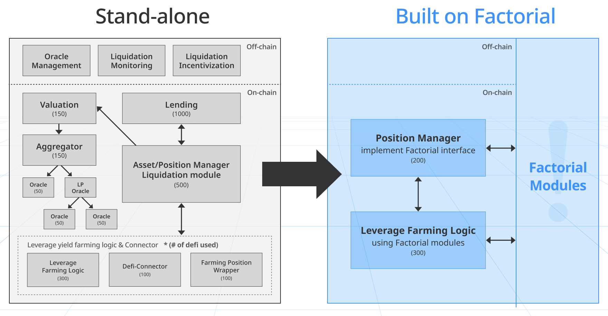
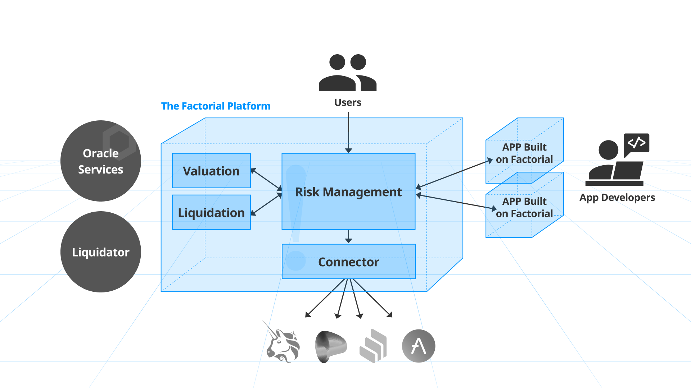

## ****Summary****

Factorial enables developers to build DeFi apps with a shorter codebase and mature/grow/accelerate their ecosystem more effectively. DeFi apps built on Factorial will utilize the framework's core financial modules and shared ecosystem resources.

## ****Problem****

Many DeFi apps are built with extensive lines of solidity contracts, but the functionalities of the majority of the codebase overlap.
Also, it is challenging and resource-consuming for new DeFi apps to acquire and grow necessary ecosystems including: oracles, liquidators, market makers, liquidity providers, and more. These combined factors result in an insecure codebase and lack of ecosystem resources, hindering potential growth.

## ****Target Users****

- 👩‍💻 **DeFi builders** want to efficiently develop and introduce a new DeFi app without reinventing the wheel or having the need to bootstrap the surrounding ecosystem.
- 👥 **DeFi users** want an integrated user experience for interacting with various DeFi apps through a unified interface and ecosystem.

## ****User Stories****

### 👩‍💻 **DeFi Builder**

1. DeFi builder comes up with a brilliant idea for a new DeFi product.
2. Developer learns how to interface with Factorial modules from their DeFi contracts.
3. Instead of developing the entire code for each standard financial process, a developer can call the functions provided by Factorial modules.
4. App on Factorial also benefits from the shared ecosystem for the necessary financial processes delegated to Factorial modules.

### 👥 **DeFi User**

1. DeFi user interacts with Factorial’s unified interface for every app built on Factorial.
2. Users on Factorial can interact with other users within Factorial’s unified ecosystem.
3. Additionally, the financial validation process in Factorial’s risk management module significantly enhances user security even in each app’s vulnerability.

## ****Solution****

By simplifying unnecessarily redundant DeFi functionalities into modules and shared ecosystems, Factorial significantly optimizes the DeFi building process. 
On Factorial, a leveraged yield farming app made of 3000+ lines of code elsewhere is achievable with less than 500 lines.

### **Factorial Modules**

| Valuation Module : Connects oracle services to calculate the value of any DeFi position in Factorial | Liquidation Module : Manages liquidation process requested by apps built on Factorial |
| --- | --- |
| Risk Management Module : risk evaluating process to prevent financially harmful changes to user’s assets from malicious logic within apps built on Factorial | Connector Module : Relays requests of execution from Factorial apps to external DeFi protocols  |

## ****Future Development****

Our prototype showcases how three DeFi apps can be built on Factorial with a significantly reduced codebase through Factorial modules. Our future plan is to generalize and simplify the utility of modules to cover a broader range of DeFi apps’ use cases.

- fund management : generalized passive investment tools
- expand connector coverage : more external DeFi connected to Factorial
- optimized swap router : easy-to-use token swap module connecting multiple DEXs
