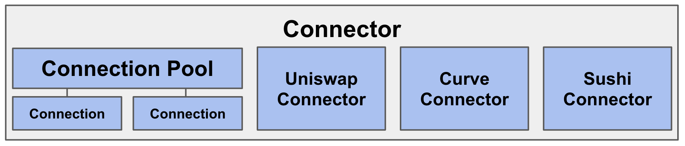

# Connector

**Connector** module is the abstract layer connecting to external DeFi.
Connector consists of `Connection Pool`, `Connection`, and a specific `Connector`, where `Connection Pool` manages `Connection`.

## Connection

Connection is a contract to make DeFi position as NFT.
Since the DeFi position is NFT-tokenized, the Connection module of Fatorial does not require to manage unnecessary state values in order to prove the ownership of the DeFi positions.

## Write Methods

### execute

`function execute(address _target, bytes calldata _data)`

Call to the target using the given data.
