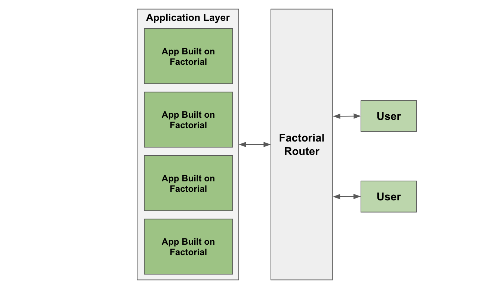

# Factorial Router

**Factorial Router** forwards the user's request to the corresponding app under the supervision of Risk management.

## Write Methods

### execute

`function execute(address _target, bytes calldata _data)`

Call to the target using the given data.

### executeBatch

`function executeBatch(uint256 _maximumLoss, address[] calldata _targetArray, bytes[] calldata _dataArray)`

Call batch to the target using the given data array.
