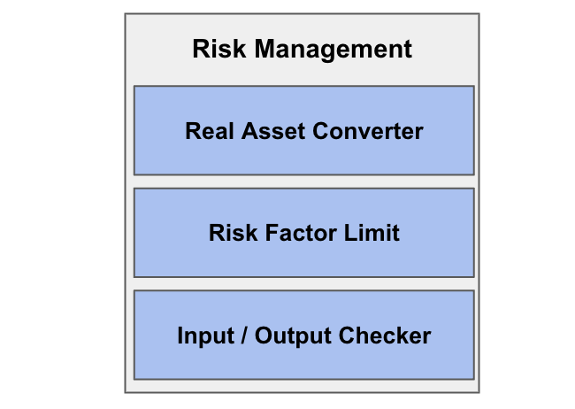

# Risk Management

**Risk Management** module monitors and restricts the asset flow by transactions.
This consists of the functionalities as asset management and limition of risk factor.

## Asset Management

`Asset Management` converts user's assets(ERC20) into factorial assets and give them to the app.
This can prevent malicious losses by tracking the changes of the user assets.
`Asset Management` of Factorial does not require the process of approval in order to remove the potential risk.

## Write Methods

### safeTransferFrom

`function safeTransferFrom(address _from, address _to, uint256 _id, uint256 _amount, bytes memory _data)`

This function override {ERC1155-safeTransferFrom}, while including tracking caller's input/outpunt asset & ERC20 converter.

### safeBatchTransferFrom

`function safeBatchTransferFrom(address _from, address _to, uint256[] memory _ids, uint256[] memory _amounts, bytes memory _data)`

This function override {ERC1155-safeBatchTransferFrom}, while including tracking caller's input/outpunt asset & ERC20 converter.

### safeTransferFrom

`function safeTransferFrom(address _from, address _to, address _id, uint256 _amount)`

Transfer with erc20 transfer.

## View Methods

### balanceOf

`function balanceOf(address account, uint256 id) public view override returns (uint256)`

If account is ERC20 holders, return ERC20 balance. Otherwise, return ERC1155 balance.
