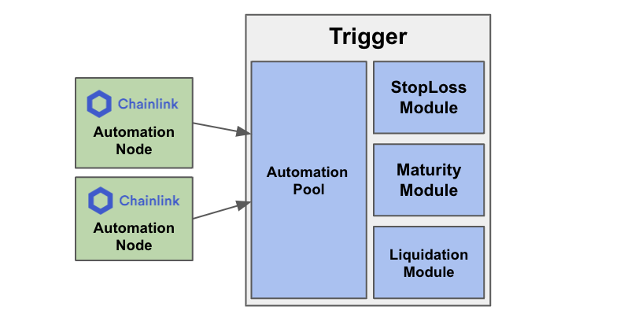

# Trigger

**Trigger** module enables the App on Factorial to provide various actions that require Trigger, e.g., Liquidate, Stop-loss, take-profit, maturity.
Automation pool provides the connection with external automation triggerer, e.g., Chainlink automation node.
