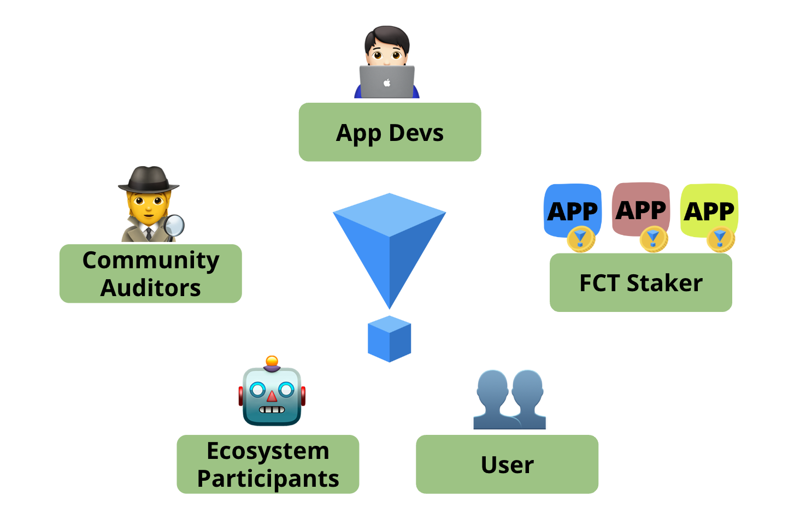
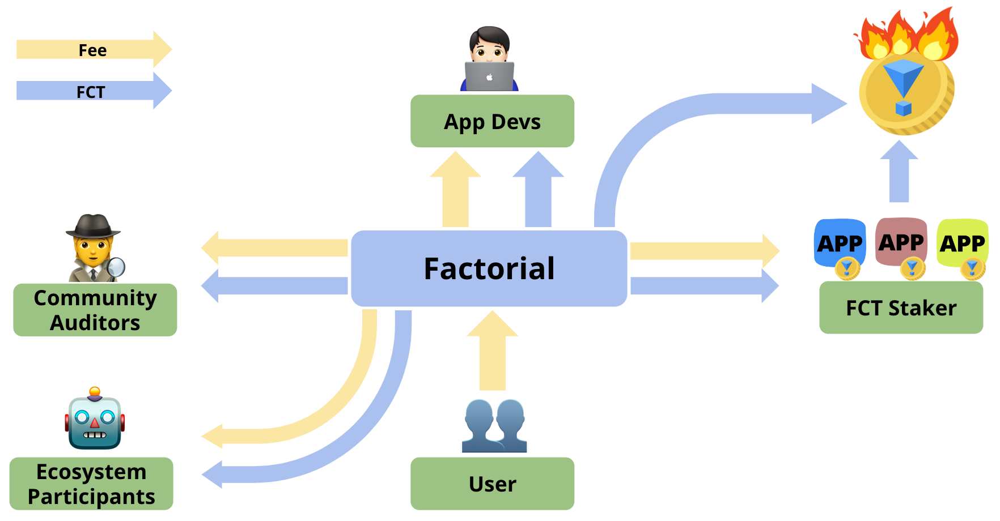

<!-- # Ecosystem

Factorial ecosystem consists of users, app developers, community auditors, FCT stakers, and other participants (e.g., liquidator and oracle service providers).

The governance token in Factorial is symbolized as `FCT`.
FCT tokenomics and user fee distributions are crucial economic designs to grow the entire ecosystem.
Factorial ecosystem and tokenomics are also all about **security**!
Factorial has two major parts of tokenomics:
    1. Fee distribution
    2. FCT incentives
The above tokenomics can accelerate positive loop of security engagement within the Factorial ecosystem.

## Fee Distribution

First, user fees are distributed to core ecosystem contributors.
App developers rewards are correlated with their security measures and amount of FCT staked at.
FCT stakers earn fixed proportion of fee paid by users, but skin in the game by being slashed for security events.
Other ecosystem participants are rewarded for their resource contribution activities.
The rest of fees are used for buy&burn FCT.

## FCT Incentives

Second, FCT incentives are also used to bootstrap ecosystem growth.
Incentives are used for hackathons, education, peer review, auditing activities, and governance leaderships.
Initially, stakers are also incentivized to encourage staking activities.
Burning occurs from protocol fees and staker slashing from app exploitation. -->
