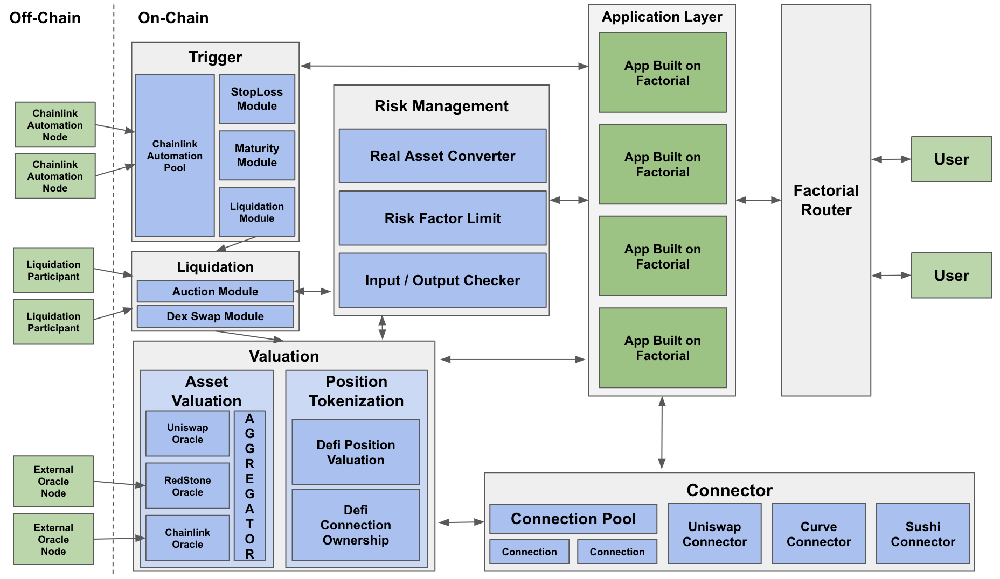

# Contracts Overview

Factorial consists of the following contracts.

## Factorial Router

Factorial Router forwards the user's request to the corresponding app under the supervision of Risk management.

## Connector

Connector is the abstract layer connecting to external DeFi.
Connector consists of `Connection Pool`, `Connection`, and a specific `Connector`, where `Connection Pool` manages `Connection`.
`Connection` is a contract to make DeFi position as NFT.
Since the DeFi position is NFT-tokenized, the Connector module of Fatorial does not require to manage unnecessary state values in order to prove the ownership of the DeFi positions.

## Liquidation

Liquidation enables the apps on Factorial to enjoy a shared liquidation environments.
Factorial can provide various types of liquidation, e.g., simple swap liquidation and auction liquation, where the liquidation type can be added continuously.

## Risk Management

Risk Management monitors and restricts the asset flow by transactions.
This consists of the functionalities as asset management and limition of risk factor.
`Asset Management` converts user's assets(ERC20) into factorial assets and give them to the app.
This can prevent malicious losses by tracking the changes of the user assets.
`Asset Management` of Factorial does not require the process of approval in order to remove the potential risk.

## Trigger

Trigger module enables the App on Factorial to provide various actions that require Trigger, e.g., Liquidate, Stop-loss, take-profit, maturity.
Automation pool provides the connection with external automation triggerer, e.g., Chainlink automation node.
